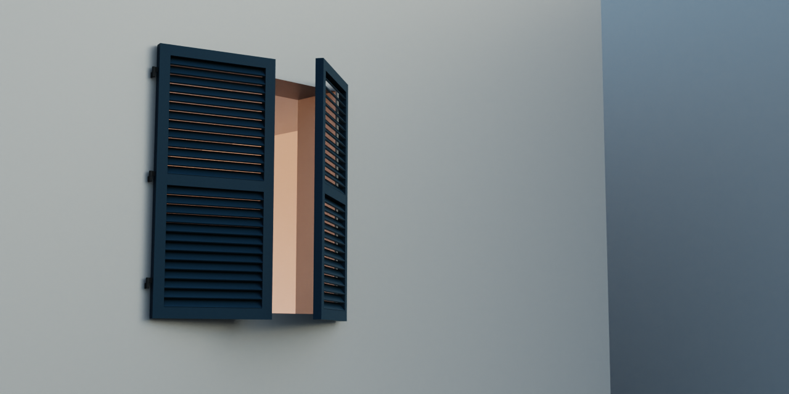

# Node groups

## Louvre Doors

This node group can be used to generate louvre doors. This node group makes use of the [Window node 
group](https://github.com/vroegop-nu/blender-asset-window) to generate the outer frames of the 
doors. The doors can have configurable hinges and the rotation of each door can be set. The door 
sections are filled with slats. The dimensions of the slats as well as their rotation along the X 
axis can be configured.

### Parameters

| Parameter           | Description                                                                      |
| ------------------- | -------------------------------------------------------------------------------- |
| Width               | Total width of the louvre doors (without the hinges)                             |
| Height              | Total height of the louvre doors                                                 |
| Frame Width         | Width of the door frame                                                          |
| Frame Depth         | Depth of the door frame                                                          |
| Frame Material      | Material applied to all parts except the hinges                                  |
| Frame Vertex Color  | The vertex color applied to all face corners of the door parts (not the hinges)  |
| Vertical Subdivs    | The number of vertical subdivisions of each door                                 |
| Slats per Segment   | The number of slats in each door segment                                         |
| Slat Thickness      | The slat thickness                                                               |
| Slat Depth          | The depth of the slats                                                           |
| Slat Rotation       | The rotation of the slats around the X axis                                      |
| Left Door Rotation  | The rotation of the left door (0 - 180 degrees, 0 = closed, 180 = fully opened)  |
| Right Door Rotation | The rotation of the right door (0 - 180 degrees, 0 = closed, 180 = fully opened) |
| Hinge Diameter      | The diameter of the hinge                                                        |
| Hinge Spacing       | The vertical spacing between the hinges                                          |
| Hinge Height        | The height of a hinge                                                            |
| Hinges              | The number of hinges on each door                                                |
| Opened              | Boolean to toggle the door being opened or closed                                |
| Opened Rotation Min | The minimum rotation when the doors are opened                                   |
| Opened Rotation Max | The maximum rotation when the doors are closed                                   |
| Hinge Material      | The material that is applied to the hinges                                       |
| Hinge Vertex Color  | The vertex color that is applied to the face corners of the hinges               |

### Attributes

| Attribute       | Type       | Description                                                                              |
| --------------- | ---------- | ---------------------------------------------------------------------------------------- |
| Col             | byte color | Vertex color applied to face corners                                                     |
| is_hinge        | boolean    | Assigned to hinge vertices                                                               |
| is_top          | boolean    | Assigned to vertices of the top (rotating) part of the hinges                            |
| is_bottom       | boolean    | Assigned to vertices of the bottom (fixed) part of the  hinges                           |
| is_outer_edge   | boolean    | Assigned to the outer edge of the door frames (inherited from Window Frame node group    |
| is_left         | boolean    | Assigned to vertices of all left sided geometry                                          |
| is_right        | boolean    | Assigned to vertices of all right sided geometry                                         |
| is_door         | boolean    | Assigned to vertices of door geometry                                                    |
| is_slat         | boolean    | Assigned to vertices of the slats                                                        |
| is_door_segment | boolean    | Assigned to vertices of inner door parts (slats)                                         |
| is_pane         | boolean    | Assigned to vertices of inner door parts (slats), inherited from window frame node group |
| is_origin_point | boolean    | Assigned to vertices of inner door parts (slats), inherited from window frame node group |
| v_origin        | vector     | Origin point of door frame part. Stored on every vertex                                  |